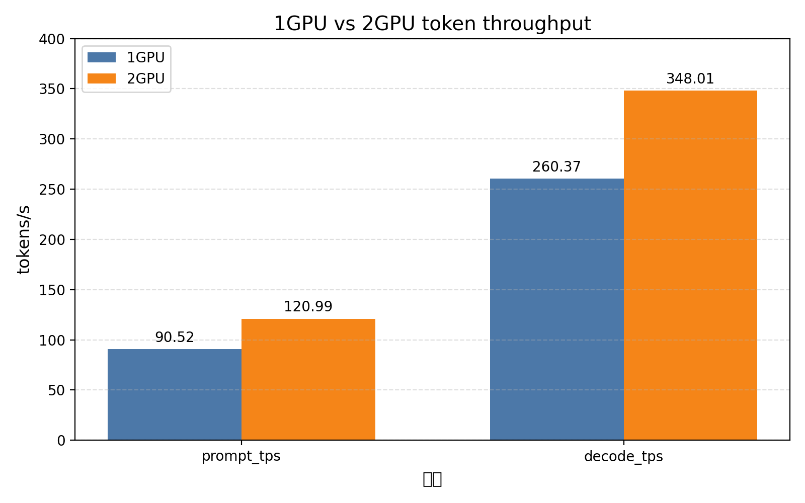
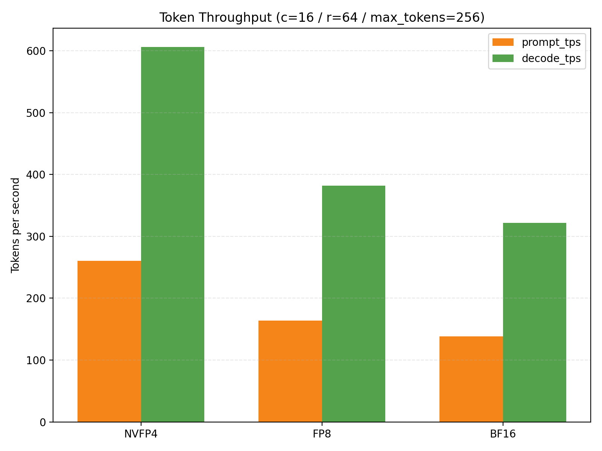
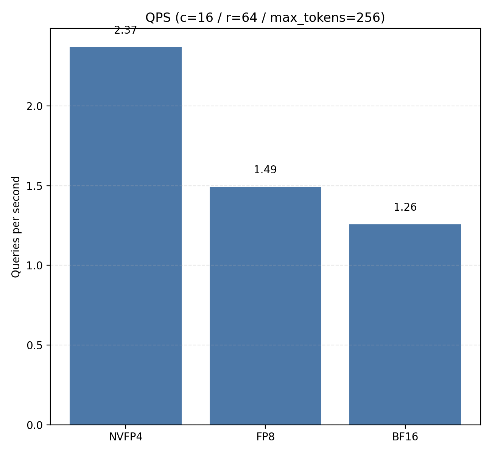
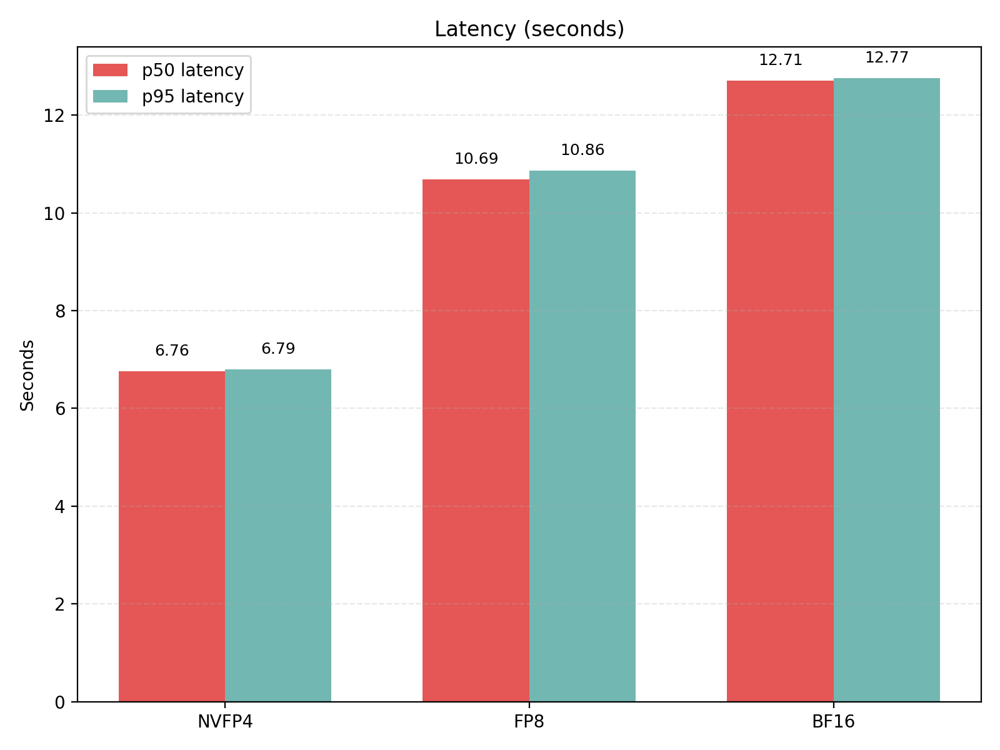
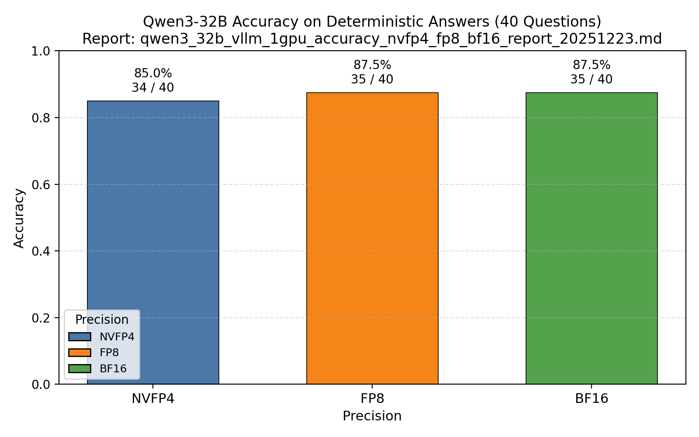
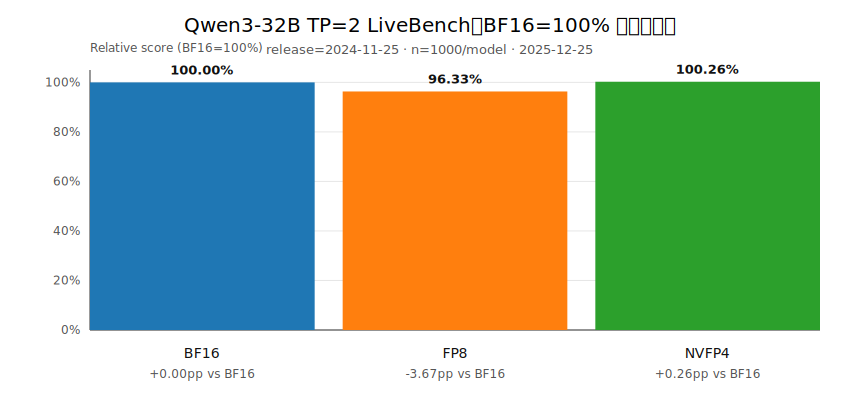
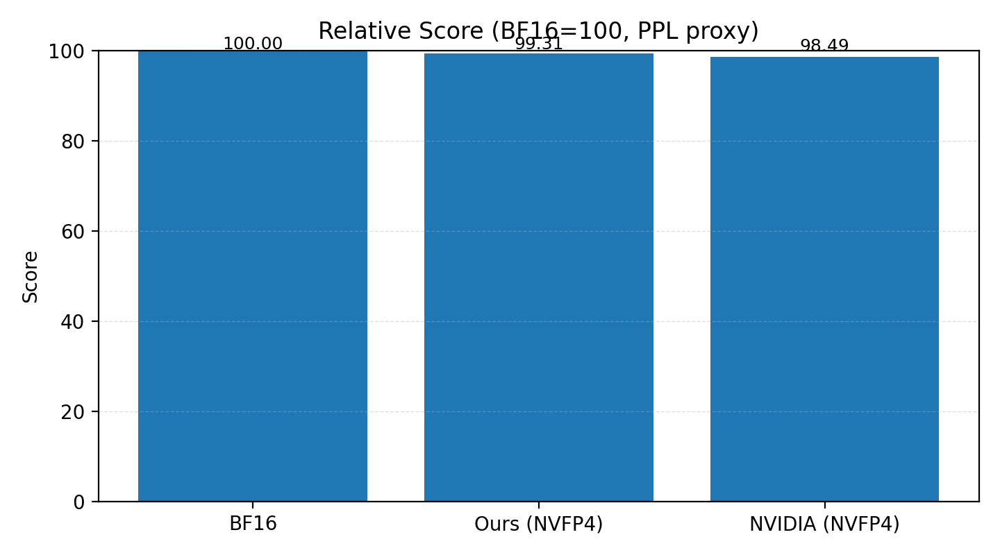

## Qwen on RTX Pro 6000（Blackwell / MIG）评测与报告

这个仓库用于沉淀在同一台 Azure VM（Standard_NC256ds_xl_RTXPRO6000BSE_v6，2× RTX Pro 6000 Blackwell，MIG 强制开启）上完成的：

- vLLM 推理吞吐压测（OpenAI-compatible `/v1/chat/completions`）
- Qwen3-32B 三精度（NVFP4 / FP8 / BF16）准确度/一致性小集合评测
- Qwen3-32B 三精度标准基准（MMLU Pro / GPQA / HLE / LiveCodeBench / SciCode / MATH-500 / AIME 2024）评测方案与进展

> README 只做“概览与导航”。详细过程、完整命令与原始结果以各自报告为准。

## 报告导航（按测试类型）

### 1) Qwen2.5-VL-72B（FP8 dynamic）吞吐：1× vs 2× MIG（跨 NUMA）

- 报告：[`qwen2_5_vl_72b_fp8_vllm_1gpu_vs_2gpu_report_20251222.md`](qwen2_5_vl_72b_fp8_vllm_1gpu_vs_2gpu_report_20251222.md)
- 结果速览（c=16 / r=64 / max_tokens=256）：
  - 1× MIG（TP=1）：decode_tps ≈ 260.37 tokens/s
  - 2× MIG（TP=2）：decode_tps ≈ 348.01 tokens/s
  - 注：2× MIG 启动时为规避 warmup OOM 使用了 `--max-num-seqs 32`，详见报告

### 2) Qwen3-32B（NVFP4 / FP8 / BF16）吞吐（1× MIG）

- 报告：[`qwen3_32b_vllm_1gpu_nvfp4_fp8_bf16_report_20251222.md`](qwen3_32b_vllm_1gpu_nvfp4_fp8_bf16_report_20251222.md)
- 结果速览（同口径：c=16 / r=64 / max_tokens=256）：
  - NVFP4：decode_tps ≈ 606.47 tokens/s（最高）
  - FP8：decode_tps ≈ 381.87 tokens/s
  - BF16：decode_tps ≈ 322.09 tokens/s

### 3) Qwen3-32B（NVFP4 / FP8 / BF16）“可判定答案”准确度（40 题小集合）

- 报告：[`qwen3_32b_vllm_1gpu_accuracy_nvfp4_fp8_bf16_report_20251223.md`](qwen3_32b_vllm_1gpu_accuracy_nvfp4_fp8_bf16_report_20251223.md)
-   测试目的：使用小题集进行粗粒度测试，评估三种精度模型的正确率差异，为后续复杂综合测试场景中的模型选择提供基础参考依据。

- 结果速览（40 题）：
  - NVFP4：34/40（0.85）
  - FP8：35/40（0.875）
  - BF16：35/40（0.875）

### 4) Qwen3-32B（BF16 / FP8 / NVFP4）LiveBench 准确度对比（TP=2）

- 报告：[`qwen3_32b_vllm_tp2_livebench_report_20251225.md`](qwen3_32b_vllm_tp2_livebench_report_20251225.md)
- 原始产物：`artifacts/qwen3_32b_vllm_tp2_livebench_20251225/`

测试描述（2025-12-25）：

- LiveBench：一个动态、定期更新的 LLM 评测基准，旨在减少数据污染和过拟合。它包含多个领域的真实任务（如数学、编程、推理等），并定期发布新版本。本次测试使用 `2024-11-25` release，`bench_name=live_bench`，`question_source=huggingface`
- 推理后端：vLLM OpenAI-compatible API（TP=2，2× RTX Pro 6000 Blackwell / MIG）
- 样本量：每个精度 1000 题（ground-truth judge 输出按均值汇总）

结果速览（BF16=100%）：

| 精度 | Overall mean | BF16=100% 相对分数 | 相对 BF16 差距 |
|---|---:|---:|---:|
| BF16 | 0.278556 | 100.00% | +0.00pp |
| FP8 | 0.268326 | 96.33% | -3.67pp |
| NVFP4 | 0.279269 | 100.26% | +0.26pp |

**NVFP4 在 LiveBench 上的 +0.26pp 优势属于统计误差范围，并非真实性能提升。** 三种精度（BF16/FP8/NVFP4）的准确度整体处于同一水平线。

### 5) Qwen3-14B（BF16 基线 / 自制量化 NVFP4（有校准） / NVIDIA NVFP4 / 自制量化 NVFP4（无校准））准确度对比

- 有校准量化报告（有校准三模型基线）：[`qwen3_14b_nvfp4_quant_and_eval.md`](qwen3_14b_nvfp4_quant_and_eval.md)
- 无校准量化报告：[`qwen3_14b_nvfp4_no_calib_quant.md`](qwen3_14b_nvfp4_no_calib_quant.md)
- 测试方式：Perplexity（PPL）代理。PPL 代理就是用一小段代表性文本来快速估算模型的困惑度（Perplexity），判断模型语言预测能力是否下降。
  它比完整基准测试更轻量，可用于量化前后的精度快速对比。
  在 NVFP4、FP8 等量化实验中，PPL 代理常作为首要、最快速的精度健康检查指标。
- 指标说明：这里用 vLLM 的 `prompt_logprobs` 计算 token-level NLL/PPL 作为“代理准确度”（越低越好）；同时给出以 BF16=100 的 Relative Score（越高越好）。
- 结果速览（PPL/NLL：数值越低越好；Relative Score：数值越高越好，BF16=100）：
  - WikiText-2（test，kept_texts=132，tokens=23922）：
    - BF16：PPL=1.687084，NLL=0.523002
    - 自制量化 NVFP4（有校准）：PPL=1.709212，NLL=0.536032
    - NVIDIA NVFP4：PPL=1.739074，NLL=0.553353
    - 自制量化 NVFP4（无校准）：PPL=1.706852，NLL=0.534650（注：评测前对 input_global_scale 做了修复）
  - UltraChat-200K（test_sft，kept_texts=200，tokens=228323）：
    - BF16：PPL=1.461068，NLL=0.379167
    - 自制量化 NVFP4（有校准）：PPL=1.470275，NLL=0.385449
    - NVIDIA NVFP4：PPL=1.481108，NLL=0.392791
    - 自制量化 NVFP4（无校准）：PPL=1.484568，NLL=0.395124（注：评测前对 input_global_scale 做了修复）
  - 总对比（两套数据按 token 加权汇总）：
    - BF16：Overall PPL=1.481134，Score=100.00
    - 自制量化 NVFP4（有校准）：Overall PPL=1.491422，Score=99.31
    - NVIDIA NVFP4：Overall PPL=1.503834，Score=98.49
    - 自制量化 NVFP4（无校准）：Overall PPL=1.504343，Score=98.46（注：评测前对 input_global_scale 做了修复）

## 仓库结构

- `tools/`
  - `bench_openai.py`：OpenAI-compatible 压测脚本（统计 QPS / prompt_tps / decode_tps / latency）
  - `eval_openai_accuracy.py`：40 题小集合准确度评测（温度 0，提取最终答案评分）
  - `eval_codegen_pass1_vllm.py`：代码类数据集 pass@1（生成代码并执行 tests）
  - `summarize_lmeval_results.py`：汇总 lm-eval 输出 JSON 到 Markdown
- `evalsets/`
  - `qwen3_32b_accuracy_suite_v1.jsonl`：40 题“可判定答案”小集合
- `artifacts/`
  - 评测原始 JSON、stdout、日志等（以日期目录分组）
- `images/`
  - 报告中引用的图表

## 复现提示（最小原则）

- 强约束：推理必须使用 vLLM；Qwen3-32B 三精度对比默认只用 1 个 MIG device（例如 `CUDA_VISIBLE_DEVICES=0`）
- 缓存建议：将 HF cache / datasets cache / TMPDIR 指向 `/data`（避免根分区空间不足）

## 注意事项

- gated 数据集：遇到 `DatasetNotFoundError: ... is a gated dataset` 时，需要在 Hugging Face 申请访问并在 VM 上登录后再跑。
- 指标口径：标准基准与小集合准确度不是同一类指标；对比时请以报告中注明的口径为准。
