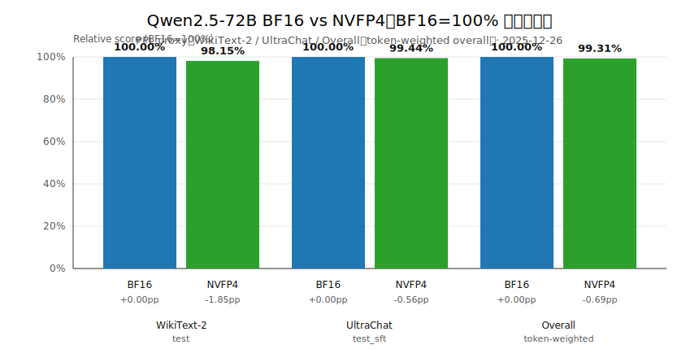

# Qwen/Qwen2.5-72B-Instruct → NVFP4：量化过程与 BF16 vs NVFP4 代理准确度对比（vLLM / llm-compressor）

本文包含两部分：

1) 在 Azure VM（1× NVIDIA RTX Pro 6000 Blackwell 96GB，MIG `4g.96gb`）上，将 Hugging Face 的 `Qwen/Qwen2.5-72B-Instruct` 做 PTQ 并导出为 vLLM 可加载的 **NVFP4（compressed-tensors）** 模型
2) 使用 vLLM 的 `prompt_logprobs` 计算 token-level NLL / PPL，对 **BF16 vs 自制量化 NVFP4（有校准）** 做代理准确度对比（含总对比表格）

约束：本报告与相关产物仅新增文件，不修改 repo 任何已有文件。

---

## 1. 目标与产物

- 目标：把 `Qwen/Qwen2.5-72B-Instruct` 量化为 NVFP4，并能被 vLLM 通过 `quantization=compressed-tensors` 稳定加载与评测
- 产物目录（自制量化 NVFP4）：`/mnt/data/models/Qwen2.5-72B-Instruct-NVFP4`

磁盘体积（远端实测）：
- BF16（HF cache blobs）：约 `136G`
- NVFP4（compressed-tensors 导出目录）：约 `42G`

---

## 2. 测试环境（Azure VM）

- GPU：NVIDIA RTX Pro 6000 Blackwell 96GB（MIG `4g.96gb`）
- Python：`3.12.3`
- vLLM：`0.13.0`
- datasets：`4.4.2`

远端工作目录：`/mnt/data/nvfp4_work`

---

## 3. HF 缓存（建议放到 /mnt/data）

根分区 `/` 容量较小，建议把 Hugging Face 模型与 datasets 缓存统一放到数据盘：

```bash
export HF_HOME=/mnt/data/hf_home
export HUGGINGFACE_HUB_CACHE=/mnt/data/hf_home/hub
export HF_DATASETS_CACHE=/mnt/data/hf_home/datasets
export XDG_CACHE_HOME=/mnt/data/hf_home/xdg_cache
export TMPDIR=/mnt/data/tmp
```

---

## 4. 量化工具链与脚本（NVFP4 校准 PTQ）

- 量化：vllm-project 的 `llm-compressor`（one-shot PTQ 流程）
- 推理与评测：`vllm`
- 量化格式：`compressed-tensors`

本 repo 中对应脚本：
- 量化（校准 PTQ + 导出）：[scripts/qwen25_72b_nvfp4_calib.py](scripts/qwen25_72b_nvfp4_calib.py)

量化核心思路（概念）：
- `oneshot()` + `QuantizationModifier(targets="Linear", scheme="NVFP4", ignore=["lm_head"])`
- 通过 UltraChat 校准数据做 PTQ 校准
- `save_pretrained(..., save_compressed=True)` 导出为 vLLM 可直接加载的 `compressed-tensors`

---

## 5. BF16 vs NVFP4 代理准确度评测（PPL proxy）

评测方法对齐 [qwen3_14b_nvfp4_quant_and_eval.md](qwen3_14b_nvfp4_quant_and_eval.md) 的口径：

### 5.1 数据集与采样规则

1) **WikiText-2**：`wikitext/wikitext-2-raw-v1` 的 `test` split
- 取前 `200` 条非空文本
- tokenizer 编码后：长度 < 16 tokens 的样本丢弃
- 超过 `max_model_len - 8` 的样本截断

2) **UltraChat**：`HuggingFaceH4/ultrachat_200k` 的 `test_sft` split
- 取前 `200` 条
- 将 `messages` 拼成多行文本：每行 `role: content`

### 5.2 指标定义（vLLM prompt_logprobs）

- 使用 `prompt_logprobs=1` 获取 prompt token 的 logprob
- 忽略第 1 个 token

$$
\text{NLL} = -\frac{1}{N}\sum_{i=1}^{N}\ell_i
\quad\quad
\text{PPL} = \exp(\text{NLL})
$$

### 5.3 评测脚本与命令

本 repo 中对应脚本：
- 评测（BF16 vs NVFP4）：[scripts/qwen25_72b_bf16_vs_nvfp4_ppl.py](scripts/qwen25_72b_bf16_vs_nvfp4_ppl.py)

本次远端运行（记录关键 env）：
- `MAX_MODEL_LEN=2048`
- `N_WIKITEXT=200`
- `N_ULTRACHAT=200`
- `BATCH_SIZE=1`
- BF16 为适配单 MIG 96GB，开启 CPU offload：
  - `BF16_CPU_OFFLOAD_GB=220`
  - `BF16_GPU_MEMORY_UTILIZATION=0.75`
  - `BF16_MAX_NUM_SEQS=1`
  - `BF16_MAX_NUM_BATCHED_TOKENS=2048`
  - `BF16_SWAP_SPACE_GB=16`

结果文件（已回传到本地 artifacts）：
- JSON：[artifacts/qwen25_72b_bf16_vs_nvfp4_ppl_20251226/qwen25_72b_bf16_vs_nvfp4_ppl_results_20251226_022040.json](artifacts/qwen25_72b_bf16_vs_nvfp4_ppl_20251226/qwen25_72b_bf16_vs_nvfp4_ppl_results_20251226_022040.json)
- Log：[artifacts/qwen25_72b_bf16_vs_nvfp4_ppl_20251226/qwen25_72b_bf16_vs_nvfp4_ppl_20251226_022040.log](artifacts/qwen25_72b_bf16_vs_nvfp4_ppl_20251226/qwen25_72b_bf16_vs_nvfp4_ppl_20251226_022040.log)

---

## 6. 结果（数值越低越好）

以下数值来自上述 JSON：

**WikiText-2（test）**

| 模型 | PPL | NLL | tokens | kept_texts | eval_s |
|---|---:|---:|---:|---:|---:|
| BF16（Qwen/Qwen2.5-72B-Instruct） | 1.717892 | 0.541098 | 23922 | 132 | 1803.29 |
| 自制量化 NVFP4（有校准） | 1.750230 | 0.559747 | 23922 | 132 | 18.23 |

**UltraChat-200K（test_sft）**

| 模型 | PPL | NLL | tokens | kept_texts | eval_s |
|---|---:|---:|---:|---:|---:|
| BF16（Qwen/Qwen2.5-72B-Instruct） | 1.379338 | 0.321603 | 228323 | 200 | 16429.52 |
| 自制量化 NVFP4（有校准） | 1.387173 | 0.327268 | 228323 | 200 | 40.35 |

---

## 7. 总对比（BF16=100%，PPL 代理分数）

这里将两套数据的 NLL 按 token 数加权汇总，再换算成 overall PPL，并将 BF16 归一化为 100%。

定义（数值越高越好）：

$$
\text{Score} = \frac{\text{PPL}_{\text{BF16,overall}}}{\text{PPL}_{\text{model,overall}}} \times 100
$$

| 模型 | Overall PPL | Overall NLL | tokens | 相对分数（BF16=100） |
|---|---:|---:|---:|---:|
| BF16（Qwen/Qwen2.5-72B-Instruct） | 1.408351 | 0.342419 | 252245 | 100.00 |
| 自制量化 NVFP4（有校准） | 1.418097 | 0.349316 | 252245 | 99.31 |



结论（在本次 PPL proxy 口径下）：NVFP4 相对 BF16 的 overall 分数约为 **99.31**，退化较小。

---

## 8. 备注

- BF16 72B 在单 MIG 96GB 上运行需要 CPU offload；因此 BF16 评测耗时显著更长（本次 UltraChat eval_s 约 4.6 小时），而 NVFP4 评测非常快。
- 这是一种“代理准确度”指标：用于快速对比量化前后语言建模拟合度，并不能替代标准 benchmark 的准确率。
